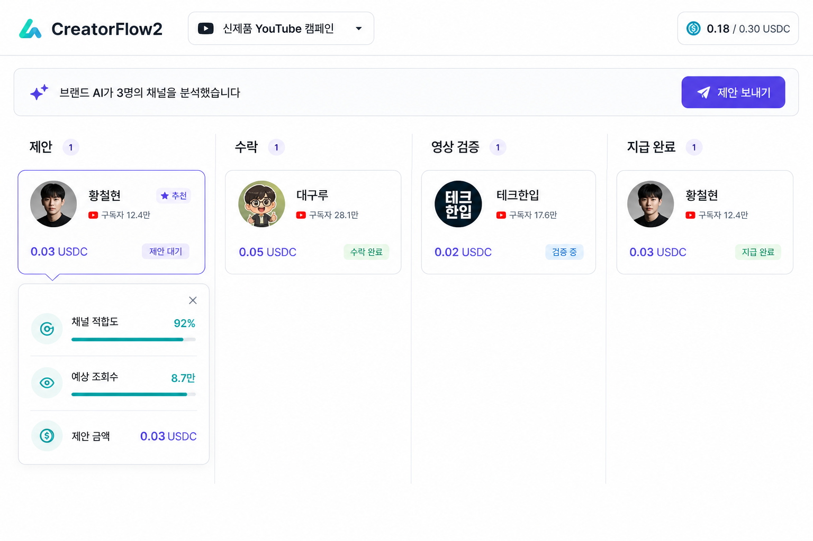

# UI & WORKFLOW — CreatorFlow2

## 기본 화면

여러 크리에이터를 가로 파이프라인으로 보여준다.

`제안 → 수락 → 영상 제출 → 검증 → 지급`

카드 기본 정보는 네 가지로 제한한다.

- 크리에이터 이름
- YouTube 채널
- 제안 또는 합의 금액
- 현재 상태 또는 다음 행동

채널 분석, AI 판단 근거, 지갑과 거래 정보는 카드의 `상세` 안에 둔다.

## 크리에이터 화면

- 제안 단계: 조건과 금액 + `수락`
- 제출 단계: YouTube 주소 + `영상 제출`
- 완료 단계: 검증·지급 상태 + Solana 거래 링크

크리에이터 Agent ID, Workspace, 협상 채팅과 기술 설정은 노출하지 않는다.

## 브랜드 AI와 시스템 표시

- 브랜드 AI: `분석 중`, `제안 생성`, `콘텐츠 승인`, `결제 서명`
- 시스템: `영상 검증`, `한도 검사`, `USDC 전송`, `온체인 확인`

두 주체의 행동을 같은 로그에 섞지 않고 라벨과 색으로 구분한다.

## 선택한 레퍼런스

시안의 파이프라인 구조를 채택하되 카드 수, 텍스트, 색을 줄여 단일 캠페인 시안 수준으로 단순화한다.
